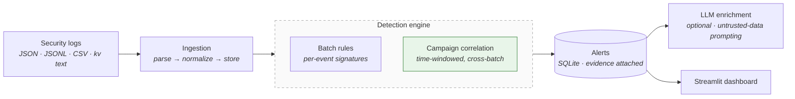

<div align="center">

# LLM Security Log Analyzer

**Defensive security analytics platform: a time-windowed detection engine over security logs, with prompt-injection-aware LLM alert enrichment and a SOC dashboard.**

[](https://www.python.org/)
[](https://fastapi.tiangolo.com/)
[](https://www.sqlalchemy.org/)
[](https://streamlit.io/)
[](LICENSE)

</div>

---

## Overview

<p align="justify">
Point this at your logs and it tells you what looks like an attack. The service ingests security events (file upload or single-event API), runs them through a two-layer detection engine, stores evidence-bearing alerts, and optionally asks an LLM to explain an alert and suggest next steps. A Streamlit dashboard gives analysts the SOC view: alert counts, severity breakdown, and one-click enrichment.
</p>

<p align="justify">
The core design decision: <strong>the deterministic detection layer is authoritative and the LLM only enriches.</strong> The model never decides what is malicious, and log content is treated as untrusted data throughout, so a malicious log line cannot become a prompt injection.
</p>

## Features

- **Two-layer detection engine.** Stateless per-event rules plus stateful campaign correlation with trailing time windows.
- **One alert per campaign.** A brute force of 50 logins produces one alert, not 50. An already-open campaign is not re-alerted inside its window.
- **Cross-batch correlation.** Detection runs against stored history, so an attack split across multiple uploads is still caught.
- **Prompt-injection-aware LLM enrichment.** The system prompt treats logs as untrusted data, never as instructions. The LLM summarizes and recommends; it does not verdict.
- **Flexible ingestion.** JSON, JSONL, CSV, and key=value text logs, with field normalization (`src_ip`/`client_ip`/`ip` all map to `source_ip`).
- **Analyst workflow.** Alert lifecycle (open, acknowledged, resolved), severity-ranked alert queue, and a Streamlit dashboard.
- **Sensible defaults for a security tool.** API-key auth on write endpoints, per-IP rate limiting, and a startup warning if `API_KEY` is unset.

## Architecture



## Quick Start

```bash
python -m venv .venv
source .venv/bin/activate
pip install -r requirements.txt
cp .env.example .env
uvicorn app.main:app --reload
```

API docs: http://127.0.0.1:8000/docs

Seed the demo data and open the dashboard:

```bash
python scripts/seed_demo.py
streamlit run dashboard/app.py
```

Or with Docker:

```bash
docker compose up --build
```

Ingest a log file:

```bash
curl -X POST http://127.0.0.1:8000/api/v1/ingest/file \
  -H "X-API-Key: $API_KEY" \
  -F "file=@data/sample_security.jsonl;type=application/x-ndjson"
# {"filename":"sample_security.jsonl","events_ingested":10,"alerts_created":5}
```

## Detection Rules

| Rule | Signal | Window |
|---|---|---|
| `BRUTE_FORCE` | 5+ failed logins from one IP | 10 min |
| `PASSWORD_SPRAY` | One IP failing against 3+ distinct accounts | 10 min |
| `CONCURRENT_ACCESS` | One user authenticating from 2+ distinct IPs | 30 min |
| `PORT_SCAN` | Port-scanning indicators in the event | per event |
| `PRIV_ESC` | `sudo`, `setuid`, admin-group changes | per event |
| `POWERSHELL_SUSPICIOUS` | Encoded/download-cradle PowerShell flags | per event |

Campaign rules correlate against stored history, so attacks spanning multiple ingests are caught. Each campaign emits exactly one alert; open campaigns are not re-alerted inside their window.

## LLM Enrichment

Disabled by default. To enable, set in `.env`:

```bash
LLM_ENABLED=true
LLM_BASE_URL=https://api.openai.com/v1   # any OpenAI-compatible endpoint
LLM_API_KEY=sk-...
LLM_MODEL=gpt-4o-mini
```

<p align="justify">
Then <code>POST /api/v1/alerts/{id}/enrich</code>, or click <strong>LLM Enrich</strong> in the dashboard. The model receives the alert plus its evidence and returns a summary, recommendations, and a confidence score. It cannot change the verdict, and the prompt explicitly forbids obeying instructions found in log content.
</p>

## HTTP API

| Method | Path | Description |
|---|---|---|
| `GET` | `/api/v1/health` | Liveness probe |
| `POST` | `/api/v1/events` | Ingest a single event (API key) |
| `GET` | `/api/v1/events` | List events, newest first |
| `POST` | `/api/v1/ingest/file` | Upload a log file: JSON, JSONL, CSV, kv text (API key) |
| `GET` | `/api/v1/alerts` | List alerts by severity, filterable by status |
| `PATCH` | `/api/v1/alerts/{id}` | Update status: open, acknowledged, resolved (API key) |
| `POST` | `/api/v1/alerts/{id}/enrich` | LLM summary and recommendations (API key) |
| `GET` | `/api/v1/stats` | Event/alert counts and high/critical total |

Write endpoints require the `X-API-Key` header when `API_KEY` is set. The app logs a warning at startup if it is empty.

## Testing

```bash
pytest tests/ -q
```

15 tests covering parsers, batch rules, campaign correlation (dedup, time windows, cross-batch detection, open-campaign suppression), the concurrent-access rule, and API regression tests including single-event ingestion.

## Configuration

| Variable | Default | Description |
|---|---|---|
| `DATABASE_URL` | `sqlite:///./security_analyzer.db` | SQLAlchemy database URL |
| `API_KEY` | _(empty)_ | Required on write endpoints when set |
| `LLM_ENABLED` | `false` | Enable LLM alert enrichment |
| `LLM_BASE_URL` | `https://api.openai.com/v1` | OpenAI-compatible endpoint |
| `LLM_API_KEY` | _(empty)_ | LLM provider key |
| `LLM_MODEL` | `gpt-4o-mini` | Model for enrichment |
| `RATE_LIMIT_PER_MINUTE` | `120` | Per-IP request limit |

## Project Structure

```
app/
  api/routes.py        # FastAPI routes, detection wiring
  core/detection.py    # batch rules + campaign correlation
  core/llm.py          # optional LLM enrichment (untrusted-data prompting)
  core/parsers.py      # JSON/JSONL/CSV/kv-text ingestion + normalization
  core/scoring.py      # risk scores and severity bands
  models.py            # SQLAlchemy models (events, alerts)
  security.py          # API-key guard
dashboard/app.py       # Streamlit SOC dashboard
scripts/seed_demo.py   # seed demo data
data/sample_security.jsonl
docs/DESIGN.md         # design notes
```

## Scope

<p align="justify">
This is a graduate-level applied security project and reference implementation, not an enterprise SIEM. Production hardening would add PostgreSQL, a message queue for ingestion, async enrichment workers, alert dedup across restarts at scale, RBAC/SSO, and evaluation against labeled data with measured precision and recall.
</p>

## License

MIT — see [LICENSE](LICENSE).
